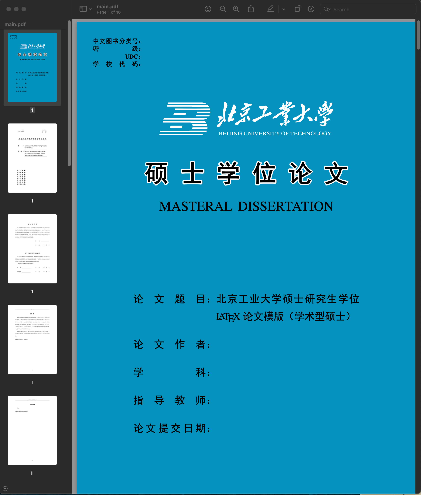

- 添加了定义、定理等环境的定义的支持，并增加了其中文引用，用法和效果见`chapt1.tex`。

---

> 注意：学校在毕业前要求提交在第三方论文机构[论无忧]的格式检查报告，而学校/学院下发的文档说明中表示仅支持`docx`或者`doc`格式，这对 $\LaTeX$ 来说十分不友好，实际上，仔细阅读该第三方论文机构的使用文档可知，可以使用zip格式提交， 因此，模版使用者只需要将生成的PDF打包为zip即可进行检查。（经测试，V1.1检查报告已经满足格式错误要求，部分错误是由检测错误、参考文献信息不全以及字体造成的），目前已经进行了进一步订正（0.05 << 0.3）。

# Overleaf版本

Overleaf版本已经通过审核并上线，同学们可以通过Overleaf开箱即用：[点此跳转](https://www.overleaf.com/latex/templates/bjutthesis/wcrpmvdkdnjs)

# 这是什么？

这是非官方的北京工业大学硕士研究生的学位论文 $\LaTeX$ 模版（1.1）

制作本模版的思路是因为Office for MacOS的体验极差，加之本人又对word十分不熟练。网上目前没有现成的模版，本着开源精神和拙劣的 $\LaTeX$ 理解，参考部分模版（见致谢）制作出该模版。希望借助此模版，使用者能将本就在毕业季不多的精力专注于文字而不是行距、行高、段落等繁琐的格式上。接下来将介绍模版的使用方法。

本模版中大量格式参考《北京工业大学研究生学位论文撰写规范》和北京工业大学博士论文 $\LaTeX$ 模版（见致谢）。

> 关于格式或修改定制问题，欢迎issue至此模版的git仓库。

# 预览

# 怎样使用？怎样修改？

## 怎样使用？

如果您只想使用本模版进行写作，请参考模版第一章。需要很微小的一部分 $\LaTeX$ 基础。

如果您想要修改模版格式，则需要具备稍微多一点的 $\LaTeX$ 模版写作基础。

### 这个版本是学术型硕士版本，专业型硕士能否正常使用？

个人精力有限，没有专门对专业型硕士做模版选项。但您只需要自行修改部分内容，如内封标题文字，外封颜色等。就可以改为专业型硕士模版。

### 需要用到什么工具或平台？

个人测试的操作系统为MacOS 12.3，tex版本为TeX Live 2022。编辑工具为NeoVim。

我并没有对其他操作系统，如windows或在线编辑器，如Overleaf专门适配。适配是未来计划，但据我所知，目前的版本在不同环境下的差别甚小，主要是没有做字体适配。在目前版本中，如果您在其他环境下遇到字体问题，请自行修改相应字体，该文档目录下提供了您可能需要的字体，您可以修改`bjutthesis.cls`文件中的字体为对应的字体文件名。如第33行宋体`Songt SC` 改为`SimSun.ttc`。

### 如果有其他问题怎么解决？

https://www.google.com/

## 怎样修改？

本着开源精神。您可以随意fork或自行下载后本地修改，是否要与该仓库合并，取决于您自己。

# 可能遇到的问题

- [x] 参考文献的数字标号可能会和中括号不对齐，虽然不影响格式检查，但可以参考[此处](https://github.com/PEKEW/BJUTLATEX/issues/5#issue-2087856053)进行修改。

收集中...

# todo

- [ ] windows选项适配
- [ ] 多平台测试
- [ ] 专业型硕士选项适配
- [x] 一些细节格式
- [ ] 还没想到

# 感谢

- 本模版参考了大量[该模版](https://github.com/fisherxt/bjutthesis)的格式，组织方式等。
- 感谢[superciv](https://github.com/superciv)同学对格式细节做出的测试和调整。
